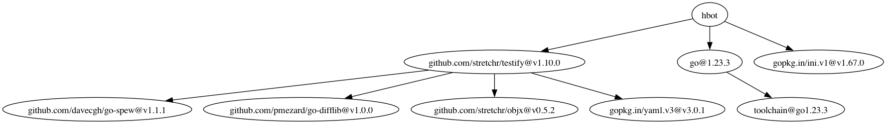

# go mod graph 图形化工具
将 `go mod graph` 命令的输出结果保存到文件中，然后使用 `show` 命令将其转换为图形化的展示。


```
# 安装·
git clone https://github.com/shzy2012/go-mod-graph-show.git && cd go-mod-graph-show && go install 

# 使用方法
go mod graph | show
```




--------

注意事项:
- 依赖 Graphviz